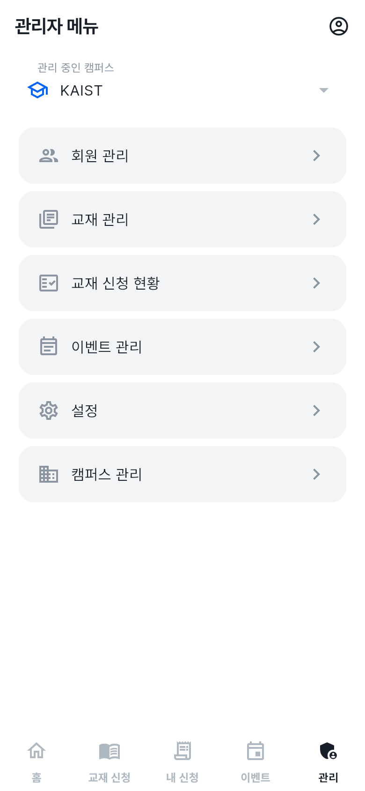
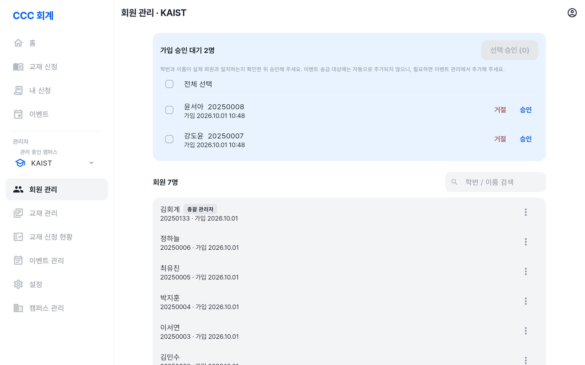
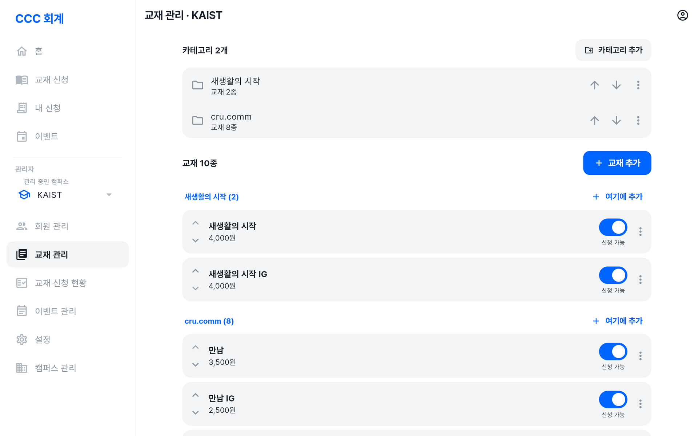
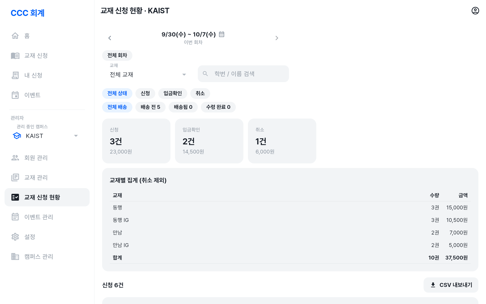
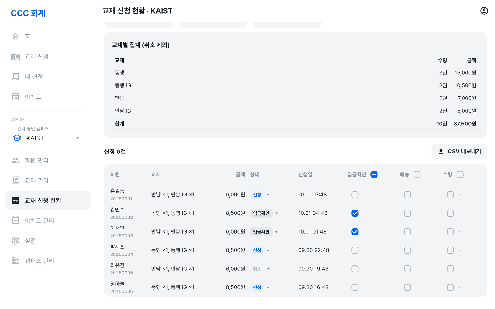
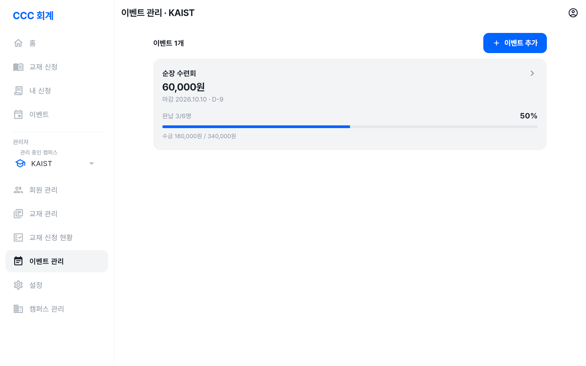
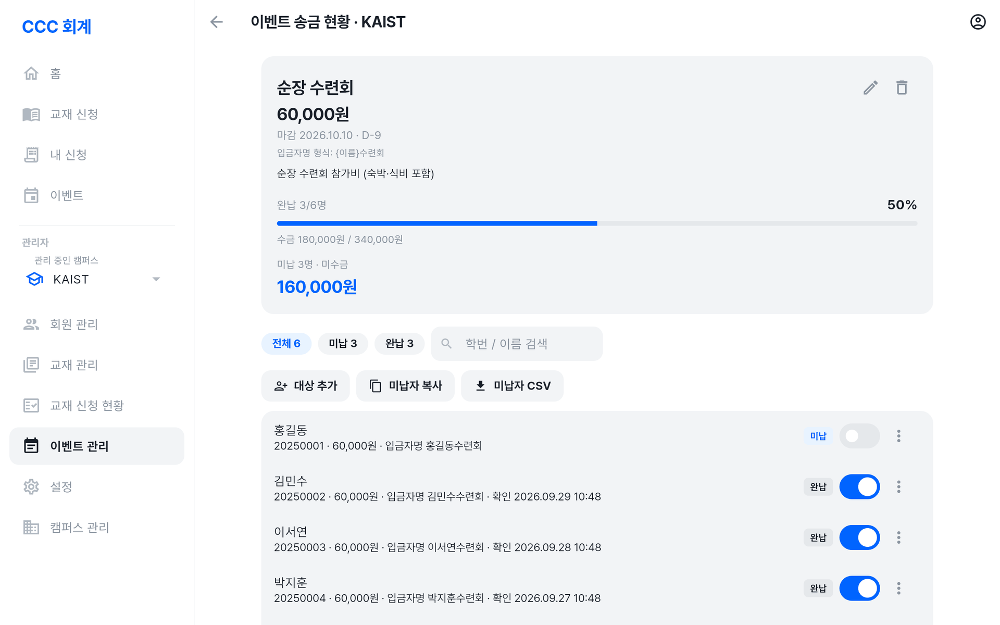
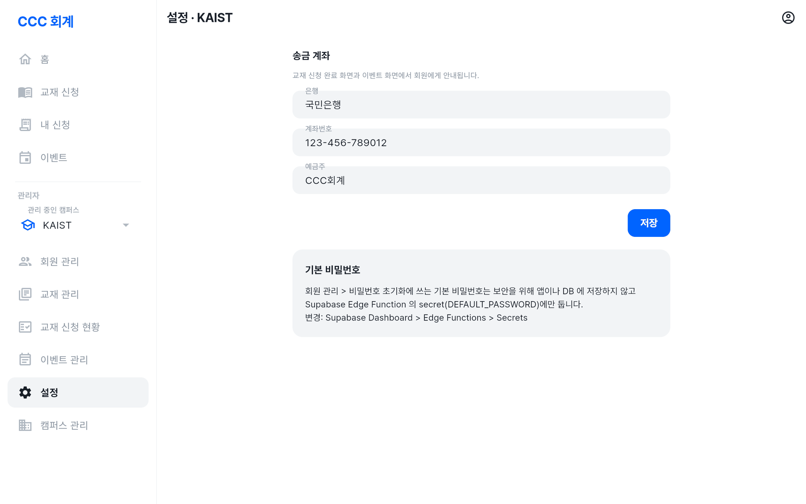

# CCC 회계 사용법: 캠퍼스 관리자

캠퍼스 회계 담당자가 **자기 캠퍼스**의 회원 · 교재 · 신청 · 이벤트 · 송금 계좌를 관리하는 방법입니다.

**🔗 접속 주소: <https://deopoler.github.io/ccc_accounting_management/>**

[← 사용법 목록](사용법.md) · 화면 사진은 예시 데이터로 찍었습니다.

> 💡 캠퍼스 관리자도 회원 기능(교재 신청, 이벤트 송금)을 그대로 씁니다. 회원 화면 사용법은 [회원 사용법](사용법-회원.md)을 보세요.

---

## 목차

1. 캠퍼스 관리자가 되려면
2. 관리 메뉴
3. 매주 할 일 (교재)
4. 이벤트 회비 걷기
5. 회원 관리
6. 교재 관리
7. 교재 신청 현황
8. 이벤트 관리
9. 설정 (송금 계좌 · 신청 마감)
10. 자주 묻는 질문

---

## 1. 캠퍼스 관리자가 되려면

1. 먼저 회원으로 가입합니다. ([회원 사용법 → 가입하기](사용법-회원.md#1-가입하기))
2. 같은 캠퍼스의 다른 캠퍼스 관리자나 총괄 관리자가 가입을 승인하고 **캠퍼스 관리자로 지정**합니다.
3. 다시 로그인하거나 새로고침하면 **관리자** 메뉴가 보입니다.

---

## 2. 관리 메뉴

PC에서는 왼쪽 메뉴의 **관리자** 아래에, 휴대폰에서는 아래쪽 **관리** 탭에 있습니다.

| 메뉴 | 하는 일 |
| --- | --- |
| 회원 관리 | 가입 승인 / 거절, 비밀번호 초기화, 캠퍼스 관리자 지정 |
| 교재 관리 | 카테고리 · 교재 등록 / 수정 / 순서 / 신청 가능 여부 |
| 교재 신청 현황 | 회차별 신청 확인, 입금확인 · 배송 · 수령 처리, 집계, CSV |
| 이벤트 관리 | 이벤트 등록, 송금 대상 지정, 송금 확인, 미납자 관리 |
| 설정 | 캠퍼스 송금 계좌, 교재 신청 마감 일시 |

> 💡 관리자 화면에서는 **자기 캠퍼스 데이터만** 보이고 바꿀 수 있습니다. 다른 캠퍼스는 화면에서도, 서버에서도 막혀 있습니다.

---

## 3. 매주 할 일 (교재)

교재 신청은 기본으로 **매주 수요일 오전 9시에 마감**되고, 같은 시각에 다음 회차가 시작됩니다.
마감 일시는 **설정 → 교재 신청 마감**에서 바꿀 수 있습니다. ([9. 설정](#9-설정-송금-계좌--신청-마감))

1. **입금 확인** (수시로): **교재 신청 현황**에서 통장 내역과 비교해 **입금확인**을 체크합니다.
2. **마감 후 주문** (마감 시각 이후)
   - **교재 신청 현황**에서 **`<`** 를 눌러 방금 마감된 회차(1회차 전)로 갑니다.
   - **교재별 집계**에서 주문할 교재와 수량을 확인합니다. 필요하면 **CSV 내보내기**로 내려받습니다.
   - 아직 입금하지 않은 신청은 상태 필터 **신청**으로 골라 볼 수 있습니다.
3. **배송**: 교재를 나눠 준 뒤 **배송**을 체크합니다. 회원 화면에 "교재가 배송되었어요"가 뜹니다.
4. **수령 확인**: 회원이 직접 수령 확인을 누릅니다. 회원 대신 처리해야 하면 **수령**을 체크합니다.

---

## 4. 이벤트 회비 걷기

1. **이벤트 관리 → 이벤트 추가**로 이벤트를 만듭니다. 입금자명 형식을 정해 두면 통장 내역과 맞춰 보기 쉽습니다.
2. 이벤트를 눌러 **대상 추가**로 송금할 회원을 고릅니다.
3. 회원들에게 앱의 **이벤트** 화면을 보고 송금하라고 공지합니다. 금액 · 계좌 · 입금자명은 앱에 안내됩니다.
4. 입금이 들어오면 회원 옆 스위치를 켜서 **송금 확인**을 합니다.
5. 마감이 다가오면 **미납자 복사**로 명단을 복사해 단톡방에 공지합니다.

---

## 5. 회원 관리

### 가입 승인

1. **가입 승인 대기 N명** 목록에서 학번과 이름이 실제 회원과 일치하는지 확인합니다.
2. **승인** 또는 **거절**을 누릅니다. 여러 명은 체크한 뒤 **선택 승인**(또는 **전체 선택**)으로 한 번에 승인합니다.
   - **거절**하면 계정이 삭제되고, 본인이 다시 가입할 수 있습니다. 학번·이름·캠퍼스를 잘못 입력한 경우에 씁니다.

> ⚠️ 승인해도 이벤트 송금 대상에 **자동으로 추가되지 않습니다.** 필요하면 이벤트 관리에서 대상으로 추가해 주세요.

### 회원 목록

**학번 / 이름 검색**으로 찾은 뒤 회원 옆 **더보기(⋮)** 에서

- **비밀번호 초기화**: 기본 비밀번호로 초기화합니다. 회원은 다음 로그인 때 새 비밀번호로 바꿔야 합니다. 기본 비밀번호는 회원에게 직접 알려 주세요. (기본 비밀번호를 모르면 총괄 관리자에게 물어보세요)
- **캠퍼스 관리자로 지정 / 해제**: 회계 업무를 함께 볼 사람을 지정합니다.

> ⚠️ 본인 계정은 메뉴가 비활성화됩니다. 캠퍼스의 **마지막 캠퍼스 관리자**는 해제할 수 없으니, 담당자를 바꿀 때는 새 담당자를 먼저 지정하세요. 총괄 관리자 계정은 관리할 수 없습니다.

---

## 6. 교재 관리

### 카테고리

- **카테고리 추가**, **이름 변경**, **위로 / 아래로**(순서), **삭제**
- 교재가 들어 있는 카테고리는 삭제할 수 없습니다. 교재를 다른 카테고리로 옮긴 뒤 삭제하세요.
- 카테고리가 하나도 없으면 모든 교재가 기본 그룹으로 보입니다.

### 교재

- **교재 추가**(또는 카테고리의 **여기에 추가**): 카테고리, 교재명, 가격, 신청 가능 여부를 입력합니다.
- **위로 / 아래로**로 카테고리 안의 순서를 바꿉니다. 회원 화면에도 이 순서로 보입니다.
- **신청 가능**을 끄면 회원이 그 교재를 신청할 수 없습니다. (품절, 판매 중지 등)
- 이미 신청된 교재는 삭제할 수 없습니다. 대신 **신청 가능**을 꺼 주세요.
- 가격을 바꿔도 이미 들어온 신청의 금액은 바뀌지 않습니다. (신청 시점 가격으로 저장됩니다)

---

## 7. 교재 신청 현황

### 회차 이동

- 위쪽 **`<  회차  >`** 로 이전 / 다음 회차로 이동합니다.
- 가운데를 누르면 **달력**이 열리고, 날짜를 고르면 그 날짜가 속한 회차로 이동합니다.
- **이번 회차로**, **전체 회차**로 바로 갈 수 있습니다.

### 선택해서 한 번에 처리하기

- 신청 왼쪽의 **체크박스**로 신청을 고릅니다. 표 머리(휴대폰은 목록 위)의 체크박스는 **현재 목록 전체 선택**입니다.
- 목록 위 막대에서 선택한 신청을 한 번에 처리합니다.
  - **입금확인 / 배송 / 수령 ▾** → **체크** 또는 **해제**. 바뀌어야 할 건수를 확인한 뒤 실행합니다. (취소된 신청, 배송 전 신청의 수령은 건너뜁니다)
  - **이전 회차로 / 다음 회차로**: 신청마다 자기 회차의 바로 앞 / 뒤 회차로 옮깁니다. 신청한 날짜와 상관없습니다.
    예) 마감 직후 들어온 신청을 방금 마감된 회차 주문에 넣을 때 → 이번 회차에서 골라 **이전 회차로**
- 이번 회차의 다음 회차가 없으면 **다음 회차로**를 누를 때 만들어집니다. 그보다 뒤로는 옮길 수 없습니다.
- 지난 회차로 옮긴 신청은 회원이 수정·취소할 수 없고, 이번 / 다음 회차로 옮기면 마감 전까지 수정할 수 있습니다.
- 필터로 가려진 신청은 선택돼 있어도 처리하지 않습니다.

### 필터

교재 · 상태(신청 / 입금확인 / 취소) · 배송 상태(배송 전 / 배송됨 / 수령 완료) · **학번 / 이름 검색**으로 목록을 좁힐 수 있습니다.

### 처리하기

| 체크 | 의미 |
| --- | --- |
| 입금확인 | 입금을 확인했으면 체크 (회원은 더 이상 수정·취소 불가) |
| 배송 | 교재를 나눠 줬으면 체크. 처리 시각이 기록됩니다. |
| 수령 | 회원 대신 수령 처리. 배송된 신청만 체크할 수 있고, "관리자" 확인으로 기록됩니다. |

- 여러 건을 한 번에 체크 / 해제하려면 신청을 선택한 뒤 목록 위 막대를 씁니다. ([선택해서 한 번에 처리하기](#선택해서-한-번에-처리하기))
- **배송을 해제하면 수령 기록도 함께 초기화**됩니다.
- 상태(신청 / 입금확인 / 취소)를 직접 바꾸려면 행의 상태 옆 **▾** 를 누릅니다.

### 집계와 내보내기

- **교재별 집계 (취소 제외)**: 교재별 수량 · 금액과 합계. 주문할 수량을 확인할 때 씁니다.
- **CSV 내보내기**: **신청 목록** 또는 **교재별 집계**를 현재 필터 그대로 내려받습니다. (엑셀 · 구글 시트에서 열기)

---

## 8. 이벤트 관리

### 이벤트 만들기

1. **이벤트 추가**를 누르고 입력합니다. (아래 표 참고)
2. 저장한 뒤 이벤트를 눌러 **송금 대상을 추가**합니다. (대상은 자동으로 들어가지 않습니다)

| 항목 | 설명 |
| --- | --- |
| 이벤트명 | 예) 순장 수련회 |
| 금액 (1인) | 기본 금액 |
| 마감일 | 선택. 없으면 "마감일 없음" |
| 입금자명 | 예) `{이름}수련회` → 홍길동수련회. `{이름}`, `{학번}` 사용 가능. 비우면 회원 이름 |
| 설명 | 선택 |

### 송금 현황 (이벤트 상세)

- 위쪽에 **송금률**(완납 N/M명)과 **수금액 / 총액**, 미납 인원과 미수금이 보입니다.
- **전체 / 미납 / 완납**으로 목록을 나누고 **학번 / 이름 검색**을 할 수 있습니다.
- **대상 추가**: 회원을 골라 추가합니다. **회원 전체 선택** 또는 **검색 결과 전체 선택**도 됩니다.
- 회원 옆 스위치로 **송금 확인**을 표시합니다. 확인 시각이 기록됩니다.
- 회원 옆 **더보기(⋮)**
  - **금액 변경**: 그 회원에게만 다른 금액을 적용합니다. (**기본 금액으로** 되돌리기 가능)
  - **대상에서 제외**
- **미납자 복사**: 미납자 명단을 클립보드로 복사합니다. (단톡방 공지용)
- **미납자 CSV**: 미납자 명단을 파일로 내려받습니다.
- 오른쪽 위 **수정 / 삭제**: 이벤트를 삭제하면 **모든 송금 기록도 삭제되며 되돌릴 수 없습니다.**

---

## 9. 설정 (송금 계좌 · 신청 마감)

- **송금 계좌**: 은행 · 계좌번호 · 예금주를 입력하고 저장합니다.
- 교재 신청 완료 화면, 내 신청 내역, 이벤트 화면에서 회원에게 안내됩니다.
- 계좌는 **캠퍼스마다 따로** 설정합니다. 처음 운영을 시작할 때 꼭 입력해 주세요.
- **교재 신청 마감**: 이번 회차의 마감 **날짜**와 **시각**을 고르고 **마감 저장**을 누릅니다.
  - 마감이 지나면 다음 회차가 시작되고, 다음 회차부터는 **같은 요일 · 시각에 1주일 간격**으로 마감됩니다.
    예) 이번 회차 마감을 금요일 오후 6시로 바꾸면, 다음 회차는 그다음 금요일 오후 6시에 마감됩니다.
  - 이미 마감된 회차나 지난 시각으로는 바꿀 수 없습니다. 마감 일시도 **캠퍼스마다 따로**입니다.

---

## 10. 자주 묻는 질문

**Q. 오래된 신청 / 이벤트 기록은 언제까지 남나요?**
용량 관리를 위해 **1년이 지난 교재 신청(회차 마감 기준)과 이벤트(마감일 기준)는 자동으로 삭제**됩니다. 보관이 필요하면 그 전에 **CSV 내보내기**로 내려받아 두세요.

**Q. 회원이 마감 후에 신청을 바꿔 달라고 해요.**
회원은 마감된 회차의 신청을 고칠 수 없습니다. 관리자는 **교재 신청 현황**에서 상태를 **취소**로 바꿀 수 있습니다. 교재·수량을 바꿔야 하면 취소한 뒤 회원에게 다음 회차에 다시 신청하도록 안내하세요.

**Q. 마감 직후에 들어온 신청을 이번 주문에 넣고 싶어요.**
**교재 신청 현황**의 이번 회차에서 그 신청을 선택하고 **이전 회차로**를 누르면 방금 마감된 회차로 옮겨집니다.

**Q. 입금확인을 잘못 눌렀어요.**
체크를 다시 눌러 해제하면 됩니다. 배송을 잘못 체크했다면 해제할 수 있지만, 수령 기록도 함께 지워집니다.

**Q. 이벤트 중간에 새 회원이 들어왔어요.**
가입을 승인해도 진행 중인 이벤트에 자동으로 들어가지 않습니다. 이벤트 상세에서 **대상 추가**로 넣어 주세요.

**Q. 회원이 비밀번호를 잊었어요.**
**회원 관리 → 더보기(⋮) → 비밀번호 초기화** 후 기본 비밀번호를 직접 알려 주세요.

**Q. 다른 캠퍼스 데이터를 봐야 해요.**
캠퍼스 관리자는 자기 캠퍼스만 볼 수 있습니다. 총괄 관리자에게 요청하세요.
