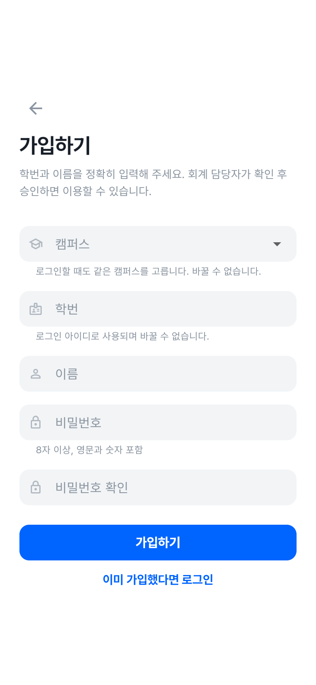
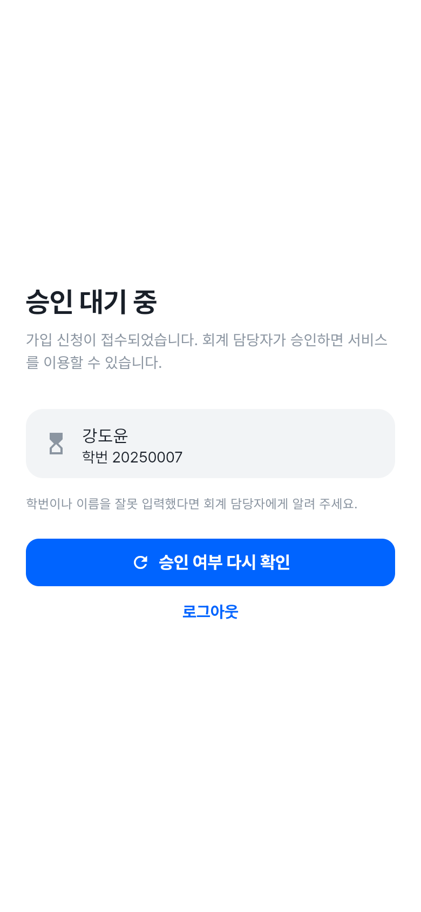
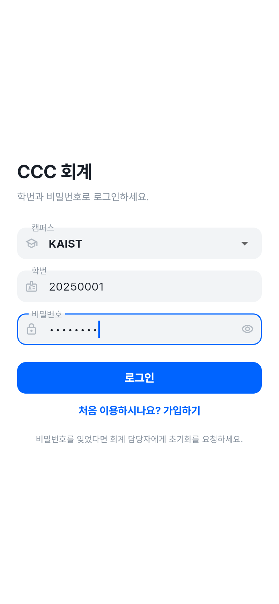
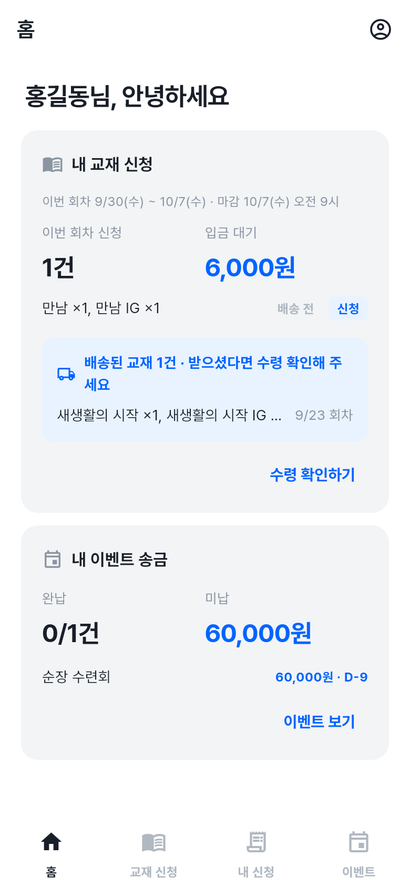
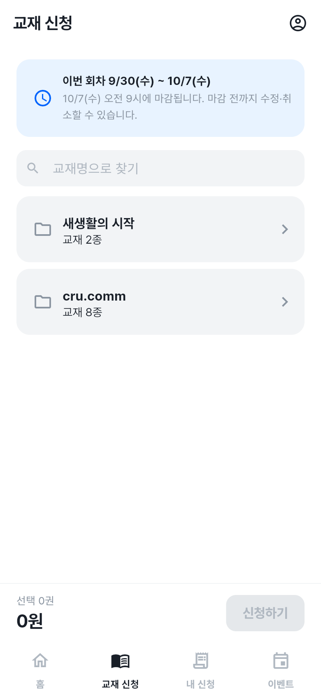
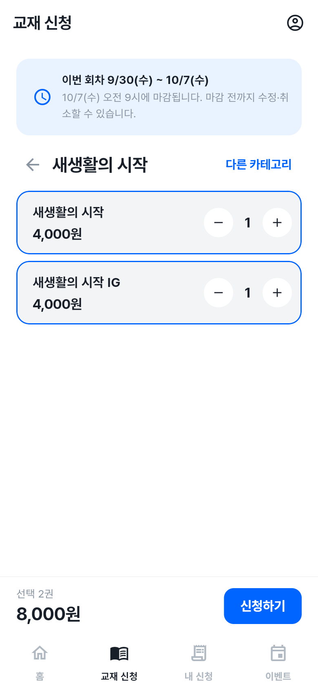
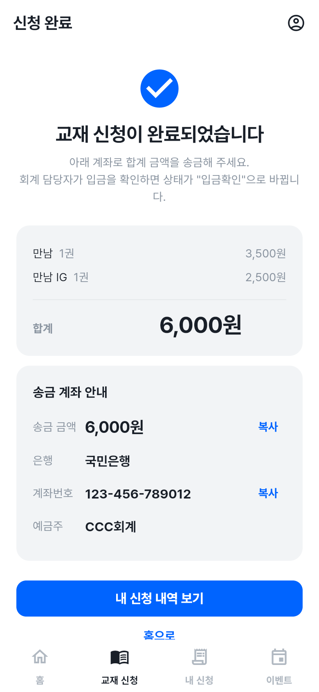
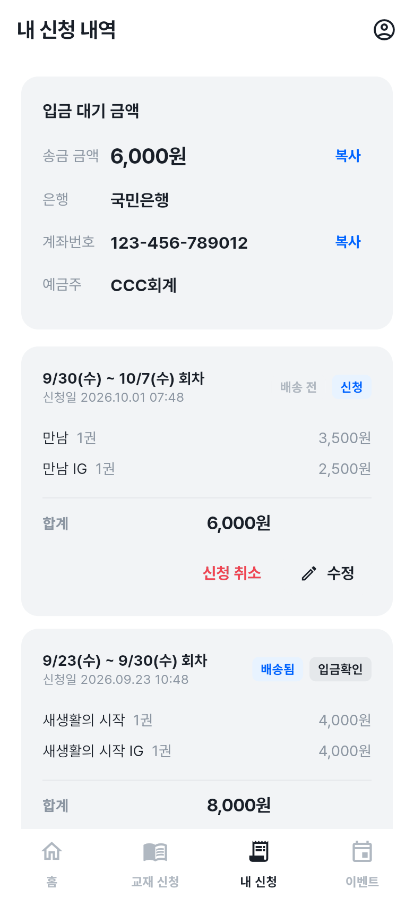
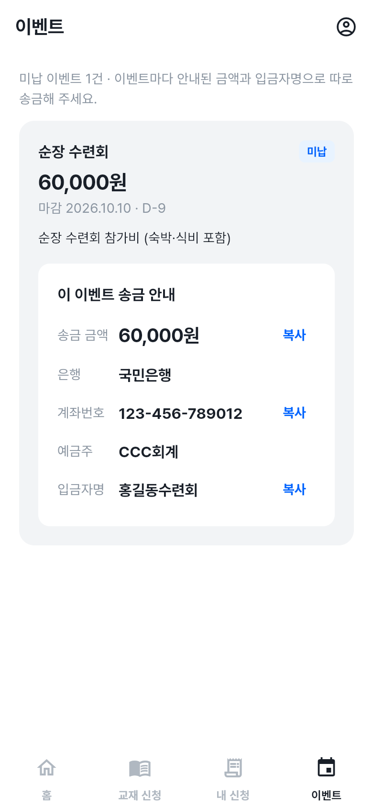
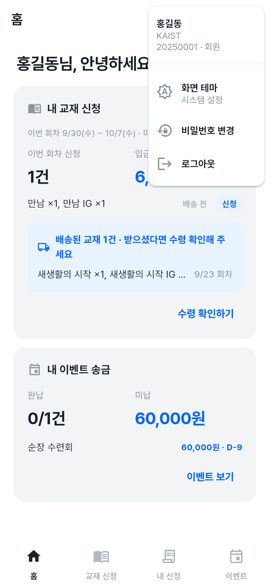

# CCC 회계 사용법: 회원

교재를 신청하고, 교재비와 이벤트 회비를 송금하는 방법입니다.

**🔗 접속 주소: <https://deopoler.github.io/ccc_accounting_management/>**

> 💡 PC·휴대폰 브라우저 모두에서 쓸 수 있습니다. 휴대폰에서는 브라우저 메뉴의 **홈 화면에 추가**로 앱처럼 설치해 쓰면 편합니다.

[← 사용법 목록](사용법.md) · 화면 사진은 예시 데이터로 찍었습니다.

---

## 목차

1. 가입하기
2. 로그인 · 비밀번호
3. 홈
4. 교재 신청
5. 내 신청 내역
6. 이벤트 송금
7. 내 정보
8. 자주 묻는 질문

---

## 1. 가입하기

1. 로그인 화면에서 **처음 이용하시나요? 가입하기**를 누릅니다.
2. 캠퍼스 · 학번 · 이름 · 비밀번호를 입력합니다. (아래 표 참고)
3. **가입하기**를 누르면 **승인 대기 중** 화면이 나옵니다.
4. 회계 담당자가 승인하면 서비스를 이용할 수 있습니다. 승인 후 **승인 여부 다시 확인**을 누르면 바로 넘어갑니다.

| 항목 | 설명 |
| --- | --- |
| 캠퍼스 | 소속 캠퍼스. 로그인할 때도 같은 캠퍼스를 고르며, **나중에 바꿀 수 없습니다.** (캠퍼스가 하나뿐이면 표시되지 않습니다) |
| 학번 | 로그인 아이디로 쓰이며 **바꿀 수 없습니다.** |
| 이름 | 실명으로 정확히 입력합니다. 회계 담당자가 이 정보로 회원을 확인합니다. |
| 비밀번호 | **8자 이상, 영문과 숫자 포함** |

 

> ⚠️ 학번이나 이름을 잘못 입력했다면 회계 담당자에게 알려 주세요. 담당자가 가입을 거절하면 다시 가입할 수 있습니다.

---

## 2. 로그인 · 비밀번호

- **캠퍼스 / 학번 / 비밀번호**로 로그인합니다.
- 마지막으로 쓴 캠퍼스는 이 브라우저에 기억됩니다.

### 비밀번호를 잊었을 때

회계 담당자에게 **비밀번호 초기화**를 요청하세요.
담당자가 알려 주는 기본 비밀번호로 로그인하면, **새 비밀번호로 바꾼 뒤에** 서비스를 이용할 수 있습니다.

---

## 3. 홈

화면 이동: PC에서는 왼쪽 메뉴, 휴대폰에서는 아래쪽 탭을 씁니다.

| 메뉴 | 하는 일 |
| --- | --- |
| 홈 | 내 교재 신청 · 이벤트 송금 요약 |
| 교재 신청 | 이번 회차 교재 신청 |
| 내 신청 | 신청 내역 확인 · 수정 · 취소 · 수령 확인 |
| 이벤트 | 이벤트별 내 송금 여부와 송금 안내 |

홈에서는 다음을 한눈에 볼 수 있습니다.

- **내 교재 신청**: 이번 회차 기간과 마감 시각, 이번 회차 신청 건수, 입금 대기 금액
- 배송된 교재가 있으면 **"배송된 교재 N건 · 받으셨다면 수령 확인해 주세요"** 안내
- **내 이벤트 송금**: 송금 대상인 이벤트의 완납 / 미납 건수와 미납 금액

---

## 4. 교재 신청

### 신청 회차와 마감

- 교재 신청은 **매주 수요일 오전 9시에 시작해 다음 주 수요일 오전 9시에 마감**됩니다.
- 화면 위에 이번 회차 기간과 마감 시각이 표시됩니다.
- **마감 전까지는 신청을 수정·취소할 수 있습니다.**

### 신청 방법

1. **교재 신청** 메뉴에서 카테고리를 고릅니다.

   

2. 교재 옆의 **− / +** 로 수량을 정합니다. **교재명으로 찾기**로 검색할 수도 있습니다.
3. **다른 카테고리**로 이동해 다른 교재도 함께 고를 수 있습니다. 고른 수량은 유지되며 한 번에 신청됩니다.

   

4. 아래의 **신청하기**를 누르고 권수와 총 금액을 확인합니다.
5. **신청 완료** 화면에 합계 금액과 **송금 계좌**가 나옵니다. 각 항목 옆의 **복사** 버튼으로 금액·계좌번호를 복사해 송금하세요.

   

> 💡 "신청 불가"로 표시된 교재는 지금 신청할 수 없는 교재입니다.

### 신청 상태

| 상태 | 의미 |
| --- | --- |
| 신청 | 신청 완료, **입금 대기 중** |
| 입금확인 | 회계 담당자가 입금을 확인함 (이후 수정·취소 불가) |
| 취소 | 취소된 신청 |

| 배송 상태 | 의미 |
| --- | --- |
| 배송 전 | 아직 배송되지 않음 |
| 배송됨 | 회계 담당자가 배송 처리함 → 받았다면 **수령 확인**을 눌러 주세요 |
| 수령 완료 | 본인 또는 회계 담당자가 수령 확인함 |

---

## 5. 내 신청 내역

- 회차별 신청 내역과 **입금 대기 금액**, 송금 계좌를 볼 수 있습니다.
- **수정**: 아직 입금확인되지 않은 이번 회차 신청은 교재·수량을 바꿀 수 있습니다.
- **신청 취소**: 마감 전이면 취소할 수 있습니다.
- 마감된 회차의 신청은 *"신청이 마감된 회차라 수정·취소할 수 없습니다."* 로 표시됩니다.
- **수령 확인**: 교재가 배송되었으면 받은 뒤 눌러 주세요. 수령 완료는 **되돌릴 수 없습니다.**

---

## 6. 이벤트 송금

수련회·순여행 같은 이벤트 회비를 내는 곳입니다.

- 내가 송금 대상인 이벤트와 **완납 / 미납** 여부가 보입니다. 대상이 아닌 이벤트는 "대상 아님"으로 표시됩니다.
- 각 이벤트에 **금액**, **마감일(D-day)**, **송금 안내**(계좌 · 입금자명)가 나옵니다.
- **이벤트마다 따로 송금**해야 합니다. 안내된 **금액과 입금자명**을 그대로 복사해서 보내 주세요.
- 나에게만 금액이 따로 정해진 경우, 내 금액과 함께 기본 금액이 표시됩니다.
- 회계 담당자가 송금을 확인하면 "송금 확인 (일시)"가 표시됩니다.

---

## 7. 내 정보

오른쪽 위 **내 정보** 버튼에서

- 이름 · 소속 캠퍼스 · 학번 확인
- **화면 테마**: 시스템 설정 / 라이트 / 다크
- **비밀번호 변경**: 현재 비밀번호 확인 후 새 비밀번호(8자 이상, 영문+숫자)로 변경
- **로그아웃**

---

## 8. 자주 묻는 질문

**Q. 가입했는데 계속 "승인 대기 중"이에요.**
회계 담당자가 아직 승인하지 않았습니다. 담당자에게 알린 뒤 **승인 여부 다시 확인**을 눌러 주세요.

**Q. 신청을 수정하려는데 버튼이 없어요.**
이미 **입금확인**되었거나 **회차가 마감**(수요일 오전 9시)된 신청은 수정·취소할 수 없습니다. 회계 담당자에게 문의하세요.

**Q. 송금했는데 아직 "신청" / "미납"으로 보여요.**
회계 담당자가 입금을 확인해야 상태가 바뀝니다. 입금자명을 안내대로 적었는지 확인해 주세요.

**Q. 이벤트 화면에 "대상 아님"으로 나와요.**
회계 담당자가 송금 대상으로 추가하지 않은 이벤트입니다. 참여한다면 담당자에게 알려 주세요.

**Q. 송금 계좌가 안 보여요.**
캠퍼스 송금 계좌가 아직 설정되지 않았습니다. 회계 담당자에게 알려 주세요.

**Q. 캠퍼스를 잘못 골라 가입했어요.**
캠퍼스와 학번은 바꿀 수 없습니다. 회계 담당자에게 가입 거절을 요청한 뒤 다시 가입하세요.
