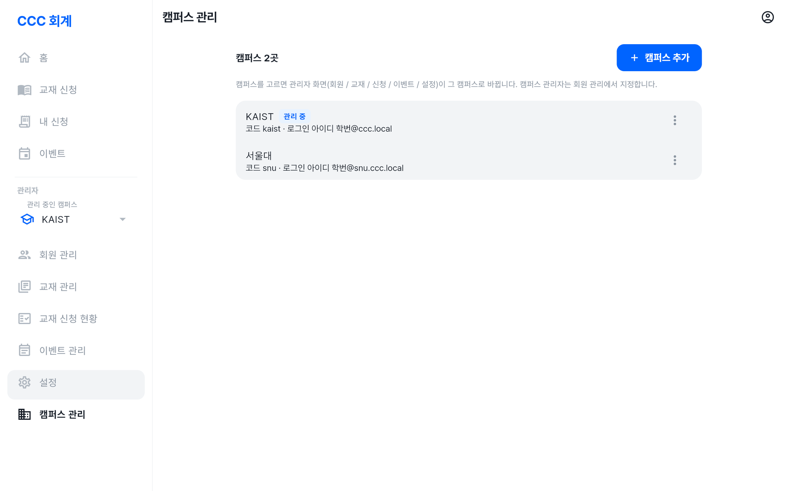

# CCC 회계 사용법

CCC 회계는 **교재 신청**과 **이벤트 송금**을 한곳에서 관리하는 웹앱입니다.
회원은 교재를 신청하고 송금할 금액·계좌를 확인하며, 관리자는 가입 승인·입금 확인·배송·송금 현황을 관리합니다.

**🔗 접속 주소: <https://deopoler.github.io/ccc_accounting_management/>**

기능을 간단히 둘러보려면 [기능 소개](기능소개.md)를 먼저 보세요. 화면 사진은 예시 데이터로 찍었습니다.

> 💡 PC·휴대폰 브라우저 모두에서 쓸 수 있습니다. 휴대폰에서는 브라우저 메뉴의 **홈 화면에 추가**로 앱처럼 설치해 쓰면 편합니다.

---

## 목차

1. 처음 시작하기 (가입 · 로그인)
2. 회원 기능
   - 홈
   - 교재 신청
   - 내 신청 내역
   - 이벤트 송금
   - 내 정보 (테마 · 비밀번호 변경 · 로그아웃)
3. 관리자 기능
   - 회원 관리
   - 교재 관리
   - 교재 신청 현황
   - 이벤트 관리
   - 설정 (송금 계좌)
   - 캠퍼스 관리 (총괄 관리자)
4. 역할과 권한
5. 자주 묻는 질문

---

## 1. 처음 시작하기

### 가입하기

1. 로그인 화면에서 **처음 이용하시나요? 가입하기**를 누릅니다.
2. 캠퍼스 · 학번 · 이름 · 비밀번호를 입력합니다. (아래 표 참고)
3. **가입하기**를 누르면 **승인 대기 중** 화면이 나옵니다.
4. 회계 담당자가 승인하면 서비스를 이용할 수 있습니다. 승인 후 **승인 여부 다시 확인**을 누르면 바로 넘어갑니다.

| 항목 | 설명 |
| --- | --- |
| 캠퍼스 | 소속 캠퍼스. 로그인할 때도 같은 캠퍼스를 고르며, **나중에 바꿀 수 없습니다.** (캠퍼스가 하나뿐이면 표시되지 않습니다) |
| 학번 | 로그인 아이디로 쓰이며 **바꿀 수 없습니다.** |
| 이름 | 실명으로 정확히 입력합니다. 관리자가 이 정보로 회원을 확인합니다. |
| 비밀번호 | **8자 이상, 영문과 숫자 포함** |

> ⚠️ 학번이나 이름을 잘못 입력했다면 회계 담당자에게 알려 주세요. 관리자가 가입을 거절하면 다시 가입할 수 있습니다.

### 로그인

- **캠퍼스 / 학번 / 비밀번호**로 로그인합니다.
- 마지막으로 쓴 캠퍼스는 이 브라우저에 기억됩니다.

### 비밀번호를 잊었을 때

회계 담당자에게 **비밀번호 초기화**를 요청하세요.
초기화되면 담당자가 알려 주는 기본 비밀번호로 로그인하고, **처음 로그인할 때 새 비밀번호로 바꿔야** 서비스를 이용할 수 있습니다.

---

## 2. 회원 기능

화면 구성: PC에서는 왼쪽 메뉴, 휴대폰에서는 아래쪽 탭으로 이동합니다.

| 메뉴 | 하는 일 |
| --- | --- |
| 홈 | 내 교재 신청 · 이벤트 송금 요약 |
| 교재 신청 | 이번 회차 교재 신청 |
| 내 신청 | 신청 내역 확인 · 수정 · 취소 · 수령 확인 |
| 이벤트 | 이벤트별 내 송금 여부와 송금 안내 |

### 홈

- **내 교재 신청**: 이번 회차 기간과 마감 시각, 이번 회차 신청 건수, 입금 대기 금액이 보입니다.
- 배송된 교재가 있으면 **"배송된 교재 N건 · 받으셨다면 수령 확인해 주세요"** 안내가 나옵니다.
- **내 이벤트 송금**: 송금 대상인 이벤트 중 완납 / 미납 건수가 보입니다.

### 교재 신청

#### 신청 회차와 마감

- 교재 신청은 **매주 수요일 오전 9시에 시작해 다음 주 수요일 오전 9시에 마감**됩니다.
- 화면 위에 이번 회차 기간(예: `10/1(수) ~ 10/7(화)`)과 마감 시각이 표시됩니다.
- **마감 전까지는 신청을 수정·취소할 수 있습니다.**

#### 신청 방법

1. **교재 신청** 메뉴에서 카테고리를 고릅니다.

   

2. 교재 옆의 **− / +** 로 수량을 정합니다. **교재명으로 찾기**로 검색할 수도 있습니다.
3. **다른 카테고리**로 이동해 다른 교재도 함께 고를 수 있습니다. 고른 수량은 유지되며 한 번에 신청됩니다.

   

4. 아래의 **신청하기**를 누르고 권수와 총 금액을 확인합니다.
5. **신청 완료** 화면에 합계 금액과 **송금 계좌**가 나옵니다. 각 항목 옆의 **복사** 버튼으로 금액·계좌번호를 복사해 송금하세요.

   

> 💡 "신청 불가"로 표시된 교재는 지금 신청할 수 없는 교재입니다.

#### 신청 상태

| 상태 | 의미 |
| --- | --- |
| 신청 | 신청 완료, **입금 대기 중** |
| 입금확인 | 회계 담당자가 입금을 확인함 (이후 수정·취소 불가) |
| 취소 | 취소된 신청 |

| 배송 상태 | 의미 |
| --- | --- |
| 배송 전 | 아직 배송되지 않음 |
| 배송됨 | 관리자가 배송 처리함 → **수령 확인**을 눌러 주세요 |
| 수령 완료 | 본인 또는 관리자가 수령 확인함 |

### 내 신청 내역

- 회차별 신청 내역과 **입금 대기 금액**을 볼 수 있습니다.
- **수정**: 이번 회차의 아직 입금확인되지 않은 신청은 교재·수량을 바꿀 수 있습니다.
- **신청 취소**: 마감 전이면 취소할 수 있습니다.
- 마감된 회차의 신청은 *"신청이 마감된 회차라 수정·취소할 수 없습니다."* 로 표시됩니다.
- **수령 확인**: 교재가 배송되었으면 받은 뒤 눌러 주세요. 수령 완료는 **되돌릴 수 없습니다.**

### 이벤트 송금

- 내가 송금 대상인 이벤트와 **완납 / 미납** 여부가 보입니다. 대상이 아닌 이벤트는 "대상 아님"으로 표시됩니다.
- 각 이벤트에 **금액**, **마감일(D-day)**, **송금 안내**(계좌 · 입금자명)가 나옵니다.
- **이벤트마다 따로 송금**해야 합니다. 안내된 **금액과 입금자명**을 그대로 복사해서 보내 주세요.
- 개인별로 금액이 조정된 경우 내 금액과 함께 기본 금액이 표시됩니다.
- 관리자가 송금을 확인하면 "송금 확인 (일시)"가 표시됩니다.

### 내 정보

오른쪽 위 **내 정보** 메뉴에서

- 학번 · 이름 확인
- **화면 테마**: 시스템 설정 / 라이트 / 다크
- **비밀번호 변경**: 현재 비밀번호 확인 후 새 비밀번호(8자 이상, 영문+숫자)로 변경
- **로그아웃**

---

## 3. 관리자 기능

관리자는 회원 메뉴 외에 **관리** 메뉴를 사용합니다. (휴대폰에서는 아래쪽 **관리** 탭)

| 메뉴 | 하는 일 |
| --- | --- |
| 회원 관리 | 가입 승인 / 거절, 비밀번호 초기화, 관리자 지정 |
| 교재 관리 | 카테고리 · 교재 등록 / 수정 / 순서 / 신청 가능 여부 |
| 교재 신청 현황 | 회차별 신청 확인, 입금확인 · 배송 · 수령 처리, 집계, CSV |
| 이벤트 관리 | 이벤트 등록, 송금 대상 지정, 송금 확인, 미납자 관리 |
| 설정 | 캠퍼스 송금 계좌 |
| 캠퍼스 관리 | (총괄 관리자만) 캠퍼스 추가 · 이름 변경 · 관리할 캠퍼스 선택 |

> 💡 관리자 화면은 **자기 캠퍼스 데이터만** 다룹니다. 총괄 관리자는 메뉴의 **관리 중인 캠퍼스**에서 캠퍼스를 바꿀 수 있습니다.

### 회원 관리

#### 가입 승인

1. **가입 승인 대기 N명** 목록에서 학번과 이름이 실제 회원과 일치하는지 확인합니다.
2. **승인** 또는 **거절**을 누릅니다. 여러 명은 체크한 뒤 **선택 승인**(또는 **전체 선택**)으로 한 번에 승인할 수 있습니다.
   - **거절**하면 계정이 삭제되고, 본인이 다시 가입할 수 있습니다.

> ⚠️ 승인해도 이벤트 송금 대상에 **자동으로 추가되지 않습니다.** 필요하면 이벤트 관리에서 대상으로 추가해 주세요.

#### 회원 목록

**학번 / 이름 검색**으로 찾은 뒤 회원 옆 **더보기(⋮)** 메뉴에서

- **비밀번호 초기화**: 기본 비밀번호로 초기화합니다. 회원은 다음 로그인 때 새 비밀번호로 바꿔야 합니다. 기본 비밀번호는 회원에게 직접 알려 주세요.
- **캠퍼스 관리자로 지정 / 해제**
- **총괄 관리자로 지정 / 해제** (총괄 관리자만 보임. 해제하면 캠퍼스 관리자로 남음)

### 교재 관리

#### 카테고리

- **카테고리 추가**, **이름 변경**, **위로 / 아래로**(순서), **삭제**
- 교재가 들어 있는 카테고리는 삭제할 수 없습니다. 교재를 다른 카테고리로 옮긴 뒤 삭제하세요.
- 카테고리가 하나도 없으면 모든 교재가 기본 그룹으로 보입니다.

#### 교재

- **교재 추가**(또는 카테고리의 **여기에 추가**): 카테고리, 교재명, 가격, 신청 가능 여부를 입력합니다.
- **위로 / 아래로**로 카테고리 안의 순서를 바꿉니다. 회원 화면에도 이 순서로 보입니다.
- **신청 가능**을 끄면 회원이 그 교재를 신청할 수 없습니다.
- 이미 신청된 교재는 삭제할 수 없습니다. 대신 **신청 가능**을 꺼 주세요.

### 교재 신청 현황

#### 회차 이동

- 위쪽 **`<  회차  >`** 로 이전 / 다음 회차로 이동합니다.
- 가운데를 누르면 **달력**이 열리고, 날짜를 고르면 그 날짜가 속한 회차로 이동합니다.
- **이번 회차로**, **전체 회차**로 바로 갈 수 있습니다.

#### 필터

교재 · 상태(신청/입금확인/취소) · 배송 상태 · **학번 / 이름 검색**으로 목록을 좁힐 수 있습니다.

#### 처리하기

| 체크 | 의미 |
| --- | --- |
| 입금확인 | 입금을 확인했으면 체크 (회원은 더 이상 수정·취소 불가) |
| 배송 | 교재를 배송(전달)했으면 체크. 처리 시각이 기록됩니다. |
| 수령 | 회원 대신 수령 처리. 배송된 신청만 체크할 수 있고, "관리자" 확인으로 기록됩니다. |

- 표 머리의 **전체 체크박스**(휴대폰은 **전체** 줄)로 **현재 목록 전체**를 한 번에 체크 / 해제할 수 있습니다. 실행 전에 건수를 확인합니다.
- **배송을 해제하면 수령 기록도 함께 초기화**됩니다.
- 상태를 직접 바꾸려면 행의 **상태 변경**을 사용합니다.

#### 집계와 내보내기

- **교재별 집계 (취소 제외)**: 교재별 수량 · 금액과 합계. 주문할 수량을 확인할 때 씁니다.
- **CSV 내보내기**: **신청 목록** 또는 **교재별 집계**를 현재 필터 그대로 내려받습니다. (엑셀·구글 시트에서 열기)

### 이벤트 관리

#### 이벤트 만들기

1. **이벤트 추가**를 누르고 입력합니다. (아래 표 참고)
2. 저장한 뒤 이벤트를 눌러 **송금 대상을 추가**합니다. (이벤트를 만들어도 대상은 자동으로 들어가지 않습니다)

| 항목 | 설명 |
| --- | --- |
| 이벤트명 | 예) 순장 수련회 |
| 금액 (1인) | 기본 금액 |
| 마감일 | 선택. 없으면 "마감일 없음" |
| 입금자명 | 예) `{이름}수련회` → 홍길동수련회. `{이름}`, `{학번}` 사용 가능. 비우면 회원 이름 |
| 설명 | 선택 |

#### 송금 현황 (이벤트 상세)

- 위쪽에 **송금률**(완납 N/M명)과 **수금액 / 총액**, 미납 인원과 미수금이 보입니다.
- **전체 / 미납 / 완납**으로 목록을 나누고 **학번 / 이름 검색**을 할 수 있습니다.
- **대상 추가**: 회원을 골라 추가합니다. **회원 전체 선택** 또는 **검색 결과 전체 선택**도 가능합니다.
- 회원 행의 체크로 **송금 확인**을 표시합니다. 확인 시각이 기록됩니다.
- 회원 행 **더보기(⋮)**
  - **금액 변경**: 그 회원에게만 다른 금액을 적용합니다. (**기본 금액으로** 되돌리기 가능)
  - **대상에서 제외**
- **미납자 복사**: 미납자 명단을 클립보드로 복사합니다. (단톡방 공지용)
- **미납자 CSV**: 미납자 명단을 파일로 내려받습니다.
- **수정 / 삭제**: 이벤트 삭제 시 **모든 송금 기록도 삭제되며 되돌릴 수 없습니다.**

### 설정

- **송금 계좌**: 은행 · 계좌번호 · 예금주를 입력하고 저장합니다.
  교재 신청 완료 화면과 이벤트 화면에서 회원에게 안내됩니다. 계좌는 **캠퍼스별**로 따로 설정합니다.
- **기본 비밀번호**(비밀번호 초기화에 쓰는 값)는 보안을 위해 앱에서 바꾸지 않습니다. 개발 담당자에게 요청하세요.

### 캠퍼스 관리 (총괄 관리자)

- **캠퍼스 추가**: 이름(예: 서울대)과 코드(예: snu)를 입력합니다.
  코드는 로그인 아이디에 쓰이므로 **나중에 바꿀 수 없습니다.**
- **이름 변경**
- **이 캠퍼스 관리하기**: 관리자 화면(회원 / 교재 / 신청 / 이벤트 / 설정)이 그 캠퍼스로 바뀝니다.
  회원 화면(내 교재 신청 등)은 본인 캠퍼스 그대로입니다.
- 새 캠퍼스의 캠퍼스 관리자는, 캠퍼스를 고른 뒤 **회원 관리**에서 지정합니다.

---

## 4. 역할과 권한

| 역할 | 할 수 있는 일 |
| --- | --- |
| 회원 | 교재 신청 · 내 신청 관리 · 내 이벤트 송금 확인 |
| 캠퍼스 관리자 | 회원 기능 + **자기 캠퍼스**의 회원 · 교재 · 신청 · 이벤트 · 계좌 관리 |
| 총괄 관리자 | 캠퍼스 관리자 기능을 **모든 캠퍼스**에서 + 캠퍼스 추가 · 총괄 관리자 지정 |

---

## 5. 자주 묻는 질문

**Q. 가입했는데 계속 "승인 대기 중"이에요.**
회계 담당자가 아직 승인하지 않은 상태입니다. 담당자에게 알린 뒤 **승인 여부 다시 확인**을 눌러 주세요.

**Q. 신청을 수정하려는데 버튼이 없어요.**
이미 **입금확인**되었거나 **회차가 마감**(수요일 오전 9시)된 신청은 수정·취소할 수 없습니다. 회계 담당자에게 문의하세요.

**Q. 송금했는데 아직 "신청" / "미납"으로 보여요.**
회계 담당자가 입금을 확인해야 상태가 바뀝니다. 입금자명을 안내대로 적었는지 확인해 주세요.

**Q. 이벤트 화면에 "대상 아님"으로 나와요.**
관리자가 송금 대상으로 추가하지 않은 이벤트입니다. 참여한다면 회계 담당자에게 알려 주세요.

**Q. 송금 계좌가 안 보여요.**
캠퍼스 송금 계좌가 아직 설정되지 않았습니다. 관리자는 **설정 → 송금 계좌**에서 입력해 주세요.

**Q. 캠퍼스를 잘못 골라 가입했어요.**
캠퍼스와 학번은 바꿀 수 없습니다. 관리자에게 가입 거절을 요청한 뒤 다시 가입하세요.
